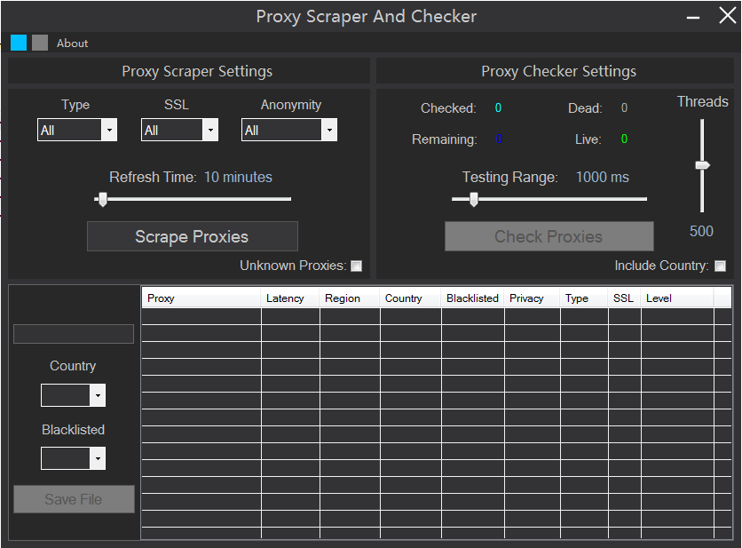
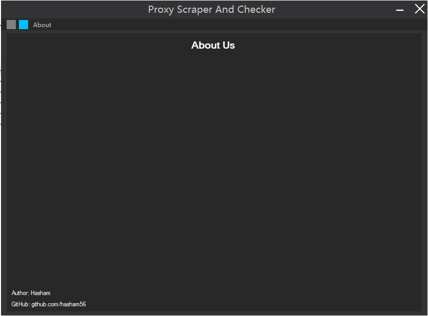
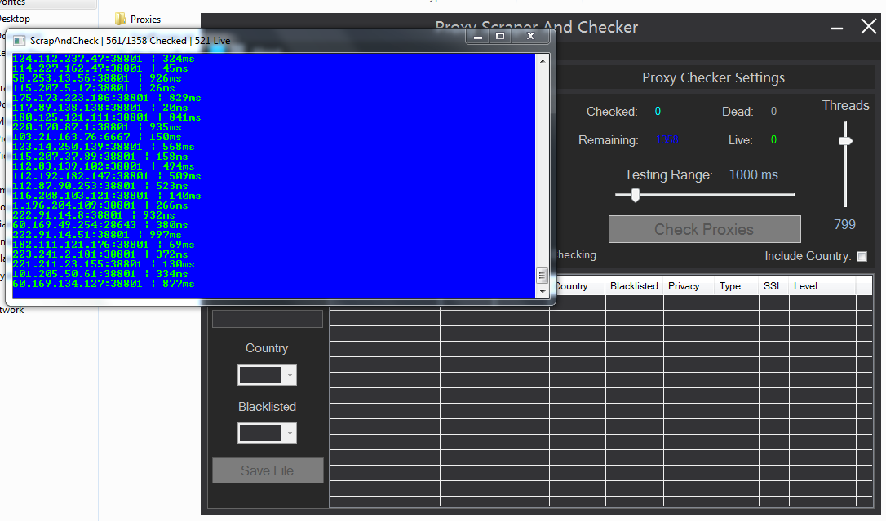
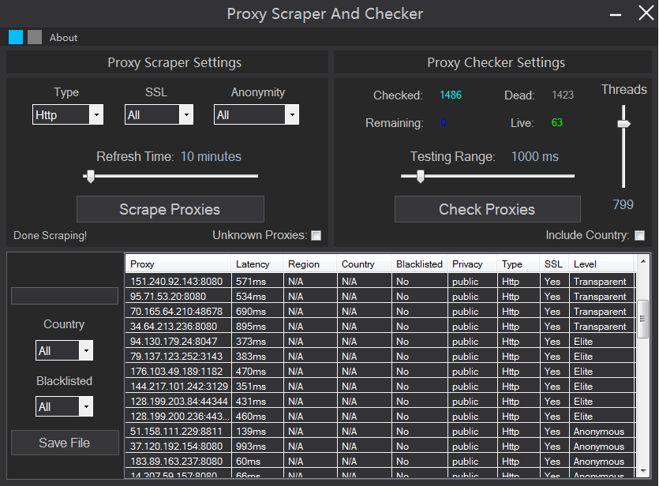
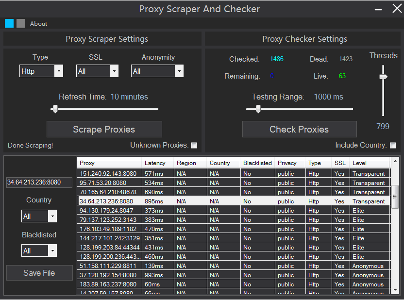

# ProxyScraperAndChecker
This is a "ProxyScraper and Checker" coded in c# using Winform Application.

## Setup
 - Step1: open project in visual studio.
 - Step2: install all missing references.
 - Step3: build and run.

## Features
 - **Modern winform GUI**
 - **Uses Threads to check the proxies faster**
 - **Customizations on proxy scraping and checking**
 - **Scrape Proxies from different websites**
 - **Country scan is slow but OK, depends on your internet**
 - **Runtime Proxy Click and Copy**
 - **Saves your selected Proxies as a file**

## Here are some screenshot of Proxy Scraper and Checker.
## Menu

## About Page

## Scraped Proxies

## Checking Proxies: Using Console application to make thread process faster

## Checked Proxies

## Click and Copy Feature

Note: The code is not so well handled.

If any queries you can ask me i will try to reply as soon as possible!
